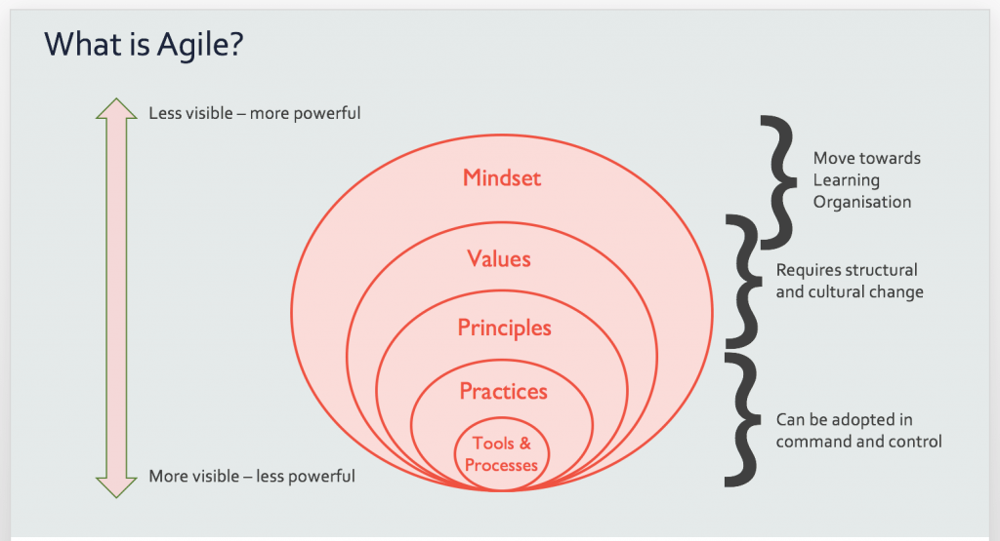

# All things Agile

A place to find all things agile.

In here you will find a whole host of topics relating to Tools and Processes, [Practices](./frameworks.markdown), [Principles](./principles.markdown), Values and Mindset.

## Background 

This guide has been put together to help share and disribute the knowledge we as coaches have on agile. As part of inductions into the software teams the agile coaches will cover most of the topics covered in this guide. As agile is such as wide topic we bearly scratch the surface during these sessions.

We wanted to create a guide that gives you a bit more detail than just the "high level" to allow people to explore agile in depth.

## What is Agile?

Before we start, we should address the question what is Agile?

If you were thinking Agile is a set of different methodologies for getting software built quickly, then you are partially correct.

Agile is very simply about "change and adaptability" and moving an organisation towards being a learning culture, centered on People.

"You can't do agile, however you can posses a agile mindset", hopefully this statement will become clearer and mean more to you throughout these pages.

This means that agile is really about finding the right things to do and doing them in the right way, or at the very least doing the right things in the wrong way, rather than the wrong things in the right way. This translates to [outcomes over outputs](https://www.extremeuncertainty.com/outcomes-not-outputs/), which you may have heard of before.

Image credit: Adventures with Agile

To take a closer look at the agile onion above, see [here](https://www.adventureswithagile.com/2016/08/10/what-is-agile/) 

Most people will assume they are "doing" agile, by simply practicing some of the agile practices, like Scrum or Kanban, perhaps even standup's or retrospectives. Some even assume they are "doing" agile as they have some tools, like Trello, Jira or post it notes.

These are the most visible aspects of agile, however they are the least powerful and can be adopted in command and control.

You can start to judge an organisation on it's agile maturity by assessing it's principles and values. Does the company share common values with the [12 agile principles?](http://agilemanifesto.org/principles.html), do they talk about, understand and practice the [agile manifesto?](http://agilemanifesto.org/).

Adopting agile principles and values requires structural and cultural change, it can be visible, however often it is not. They are more powerful than practices and tools.

The least visible and most powerful is the mindset. This requires a move towards a learning organisation, where it is "safe to fail". This means that we must forget or change what is in people's heads.
It changes the way we think and interact. This change will take time and it's incremental, we can't do this all at once. It can take a long time, as it takes time to change the way people are.

You can’t teach this. Or at least not directly. Some people have this naturally. Most children probably do. Sometimes, just like Zen, the Agile mindset is obtained not by learning, but by unlearning all those layers of command and control, Theory X, and Project Management skills.

## What are the benefits of Agile?

- Managing changing priorities 
- Improved project visibility
- Improved team morale
- Accelerated time to market
- Increased productivity 
- Enhanced software quality 
- Simplified development process
- Reduced risk

## What are the barriers to Agile adoption?

- Ability to change organisational culture
- General resistance to change 
- Availability of personnel with necessary skills 
- Management support
- Project complexity or size
- Customer collaboration 
- Confidence in ability to scale agile 

Below I have listed some examples of things you are likely to find under each agile layer. The larger the onion circle, the more powerful but less obvious it is - I strongly suggest viewing this [page](https://www.adventureswithagile.com/2016/08/10/what-is-agile/) to understand that further.

## Tools and Processes

- Trello, Jira etc
- Screenful
- Post it notes
- Wall boards

## [Practices](./frameworks.markdown)

- Agile Frameworks
  - Scrum, Kanban, Scrumban and XP
- Scaling Frameworks
    - SAFe, LeSS and DAD
- Standups
- Retrospectives
- Estimation (Cynefin, Story Points, Dog Pointing, T-shirt sizing etc)
- Agile Planning Onion
- Roadmaps
- Value Stream Mapping
- Story Writing
- Prioritisation

## [Principles](./principles.markdown)

- Agile Manifesto
- Agile Principles

## Mindset

- The complexity belief
- The people belief
- The proactive belief

For more on the mindset check this [link](https://www.adventureswithagile.com/2017/03/25/what-is-the-agile-mindset/) out
