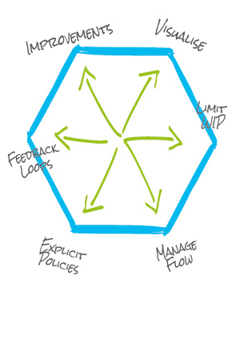

# Frameworks

Frameworks are considered as "practices" as described in the agile onion throughout these pages. Below are a list of the common frameworks used within agile software development.

You will find examples of when we may use a particular framework, who might do what and how we use those frameworks.

If you want to learn more about any of the below, please come and speak to one of the agile coaches.

## Scrum

.jpg)

Scrum is a framework primarily used in software development and works best when we work in the complex space. It has and can be used outside of software development, however when surveyed 80% of ScrumMaster's had not applied this framework to other industries.  

It's primary principles are;

- Welcome changing requirements, even late in development.
- Deliver valuable working software frequently. This is our primary measure of progress.
- Business people and developers must work together daily throughout the project, at a sustainable pace.
- Simplicity - the art of maximizing the amount of work not done - is essential.
- Inspect and adapt.
- Self-organizing teams.

Scrum has defined roles as part of the project team, these are;

- Product Owner
- ScrumMaster
- Team

### Product Owner

Specifically relating to the **scrum framework** a Product Owner's role is;

- Defines the features of the product, decides on release date and content
- Is responsible for the profitability of the product (ROI)
- Prioritizes features according to market value
- Can change features and priority every 30 days (can be 2 weeks, 3 weeks)
- Accepts or rejects work results

The term Product Owner exists in other agile frameworks, where the role maybe played differently.

### ScrumMaster

The role of a ScrumMaster is specific to the scrum framework and if held in its truest sense, not found in other agile frameworks.

A ScrumMaster's role is;

- Ensures that the team is fully functional and productive
- Enables close cooperation across all roles and functions and removes barriers
- Shields the team from external interferences
- Ensures that the process is followed. Invites to daily stand up (daily scrum), iteration review (demo) and planning meetings

A ScrumMaster is likely to be a master of the scrum framework and may have little knowledge of other practices used outside of scrum.

They differ from an Agile Coach. A coach in its purest sense is not embedded into any one team and focuses on helping an organisation achieve a learning culture centred on its people.

Agile Coaches will work with all levels of the organisation to live by an actively practice agile and organisational values.

The Agile Coach will strive to continuously improve teams agile processes, practices and team dynamics, whilst retaining or improving the ability to deliver consistently at a sustainable pace.

You may find in some organisations that Agile Coaches will also play the role of a ScrumMaster due to their acquired skill set.

### Team

Within the scrum framework, the "team" will traditionally comprise of developers, developers in test (also know outside of SB as QA, QA Testers and Tester), front end and UX.

The role of the team is;

- Cross-functional, seven plus/minus two members
- Selects the iteration goal and specific work items
- Has the right to do everything within the boundaries of the project guidelines to reach their iteration goal
- Organizes itself and its work
- Demos work results to the Product Owner

### The Scrum Framework in a nut shell

- A product owner creates a prioritized wish list called a product backlog.
- During sprint planning, the team pulls a small chunk from the top of that wish list, a sprint backlog, and decides how to implement those pieces.
- The team has a certain amount of time — a sprint (usually two to four weeks) — to complete its work, but it meets each day to assess its progress (daily Scrum).
- Along the way, the ScrumMaster keeps the team focused on its goal.
- At the end of the sprint, the work should be potentially shippable: ready to hand to a customer, put on a store shelf, or show to a stakeholder.
- The sprint ends with a sprint review and retrospective.
- As the next sprint begins, the team chooses another chunk of the product backlog and begins working again.

## Kanban

There is much debate as to whether Kanban is classed as an agile framework. This comes from the fact that Kanban falls primarily under the Lean Methodology.

It is widely accepted that Lean and Agile share very similar values and principles, therefore are usually considered the same thing, in fact it's usually accepted that Lean falls under the Agile umbrella rather than stands alone.

It's important to remember that they do have their differences, in some cases one will be more effective than the other.

Kanban for example is not primarily limited to software development, you can find Kanban systems being used in all types of industries, from manufacturing, hospitals, event planning, software development and even at home.

### Kanban Facts

- Kanban written in Japanese means “signal card”
- Kanban written in Chinese means “sign” or “large visual board”
- The Kanban method incorporates both meanings
- Originated from the manufacturing industry, and formalised by Toyota Production Systems

It's primary principles are;

- Leadership
- Understanding
- Agreement
- Respect

In Kanban we start with what we know now. We agree to pursue incremental, evolutionary change. This means that we initially respect current roles, responsibilities and job titles. We encourage acts of leadership at all levels, from individual contributors to senior management.

### Little k and Big K

An unknowmn fact about Kanban, is that it compramises of 2 parts. Little k and Big K. Below you will see some examples of what falls under each.

As a general rule of thumb, when we refer to Kanban we are referring to both elements, the method and the system. Simply put the method, is like chosing Scrum, XP, Scrumban as our framework.

The system refers to how we design our kanban system to suit us, so how we design our boards, what roles we decide to have in teams, if we use WIP limits, swimlanes, class of service, what kanban cadence meetings we have etc.

Kanban "method" (big k)
- Use of kanban system with feedback mechanisms and collaborative work
- Evolutionary improvement

kanban "system" (small k)
- Use a board to visualise the work flow
- Make process policies explicit
- A pull system
- Cards allow work to be pulled

### Managing Change

Kanban incorporates 2 forms of change, with Kaizen often leading the way, ahead of Kaikaku.

What does [Kaizen](https://en.wikipedia.org/wiki/Kaizen) and [Kaikaku](https://en.wikipedia.org/wiki/Kaikaku) mean I hear you ask! Kaizen means evolutionary change (continuous improvement) and Kaikaku means revolutionary/radical change.

The Kaizen approach is often more acceptable, less risky and faster than radical change.

### Kanban method core practices

Visualise - Limit WIP - Manage Flow - Make process policies explicit - develop feedback mechanisms - improve collaboratively using "safe to fail" experiments

Once you get to the end of the above process we repeat the cycle.

### When do we typically use kanban?

Kanban (big K) "The Method"

- Used as a change management method
- Where the results of revolutionary change are too uncertain
- To provoke evolution and improvement in existing systems

kanban (little k) "The System"

- Where planning systems don't work i.e support maintenance and operations teams
- Often in combination with Agile/Scrum (this often means that teams use kanban before it reaches the software teams and links into value stream mapping)
- Advanced teams who find Agile/scrum restrictive i.e not being tied to sprints/iterations

### What are the benefits of Kanban?

- Visibility
- Eliminates overburdening
- Reduces or eliminates multi-tasking
- Controls or eliminates interruptions, disruptive task-switching and variability
- Shorter lead times
- Better quality
- Deferred commitment

For more detail on Kanban see the frameworks slide deck [here](https://docs.google.com/presentation/d/1SxVAjFyDUY2uxywQ4X_K4dTc60xEOh1v17ggTIkWI4o/edit#slide=id.g1d86f9ddad_0_462) or visit the lean 

Kanban Website [here](http://leankanban.com/)

## Scrumban

Scrumban = Scrum + Kanban

- Use the prescriptive nature of Scrum to be Agile
- Use the process improvement of Kanban to allow the team to continually improve its process

### Advantages

- Quality
- Just-in-time (decisions and facts just when they are needed)
- Short lead time
- Kaizen (continuous improvement)
- Minimizing waste (everything that is not adding value to the customer)
- Process improvement by adding some values of Scrum as and when needed

### When do we use Scrumban?

- Maintenance projects
  - Event-driven work
  - Help desk/support
- Hardening/packaging phases
- Projects with frequent and unexpected user stories or programming errors
- Sprint teams focused on new product development
  - Work preceding sprint development (backlog, R&D)
  - Work following sprint development (system testing, packaging, and deployment)
- If Scrum is challenged by workflow issues, resources and processes
- To manage improvement communities during/after Scrum roll-out

### Scrumban key facts

- Kanban is compatible with Scrum
- Adding WIP and visualization to Scrum, i.e. Scrumban, helps improve Sprint Commitment effectiveness.
- However, it is also introduces the WIP limit as a mechanism to catalyze incremental changes.
- The WIP limit obviates the need for commitment to drive change, reduces any dysfunctional reliance on heroic effort, and improves overall systems thinking when considering potential improvements.
- It looks somewhat like Scrum at the practice level, but at the cultural level it will look like Kanban – soft evolution rather than shock treatment and revolution.

To see the difference between kanban - scrumban and scrum - kanban check out slide 42 [here](https://docs.google.com/presentation/d/1SxVAjFyDUY2uxywQ4X_K4dTc60xEOh1v17ggTIkWI4o/edit#slide=id.g2203184df3_0_24)

## Extreme Programming

“Extreme Programming (XP) is a software development methodology developed primarily by Kent Beck. XP was one of the first agile methods, indeed XP was the dominant agile method in the late 90s and early 00s before Scrum became dominant as the noughties passed. Many people (including myself) consider XP to be the primary catalyst that got attention to agile methods, and superior to Scrum as a base for starting out in agile development.” Martin Fowler, July 2013

### XP's values

- Simplicity
- Communication
- Feedback
- Respect
- Courage

### Rules of XP

- Planning
- Managing
- Designing
- Coding
- Testing

### XP's key facts

- XP is a framework that is underutilised and uncommon in todays software development world. Once upon a time it was the leading framework.
- When people say they are doing XP, they are likely Pair Programming, or following some of the other processes within XP, not following the XP framework in it's entirety

For further detail on each of these frameworks, take a look at this [slide deck](https://docs.google.com/presentation/d/1SxVAjFyDUY2uxywQ4X_K4dTc60xEOh1v17ggTIkWI4o/edit#slide=id.p).
Come and speak to your Agile Coaches if you want to understand these further.
