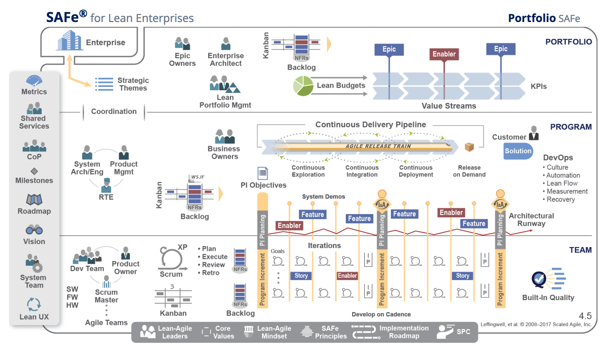
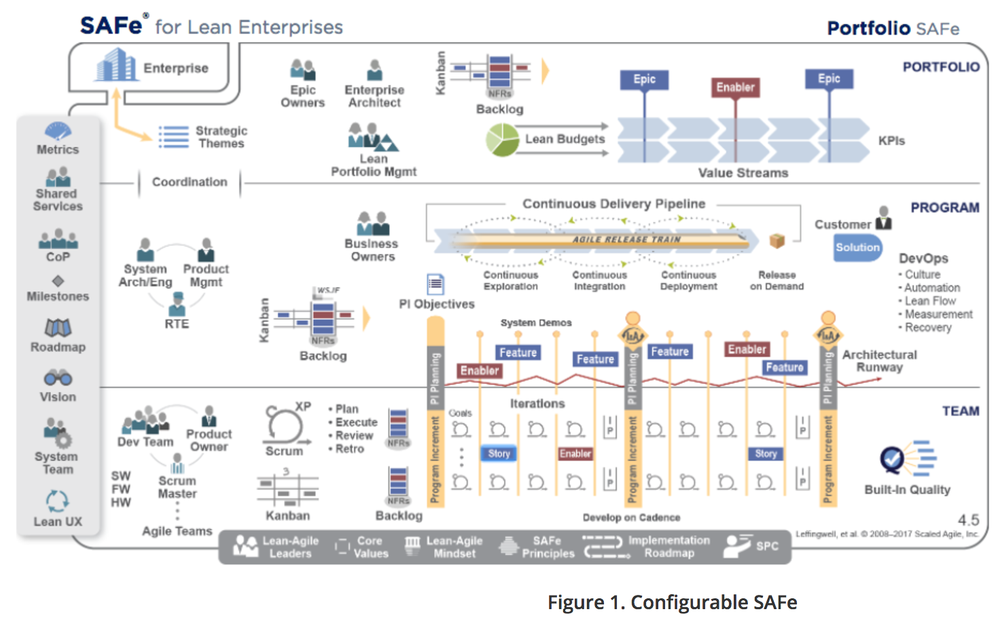
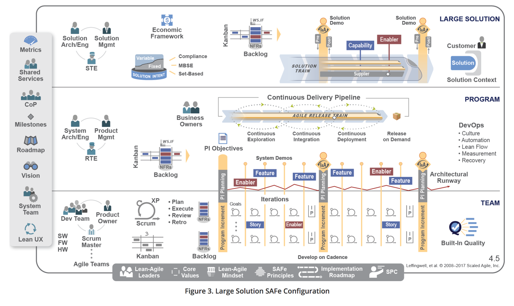
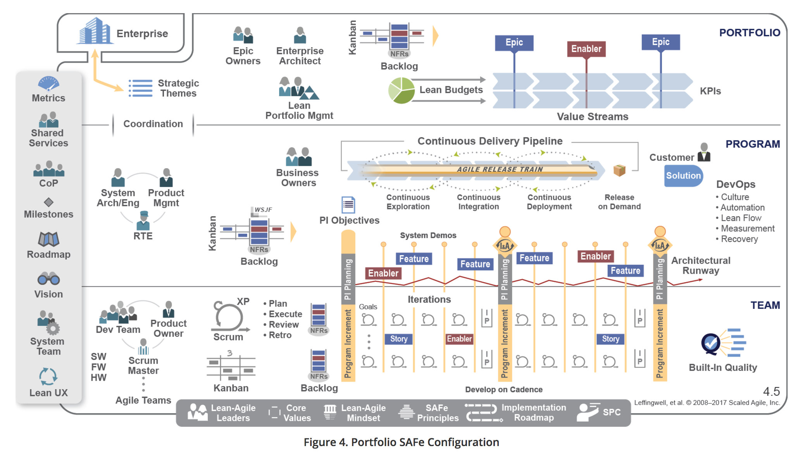

# Scaling Frameworks

## What are scaling frameworks?

As agile continues to grow in popularity, so does the idea of scaling out agile across a whole organisation.

As such there are now quite a few scaling frameworks in the market.

What do I mean by scaling across a whole organisation? well to put it simply, agile practices are commonly adopted in project teams/software development teams and not supporting functions such as HR, Finance and the Contact Centre to give a few examples.

Scaling fameworks attempt to close that gap by having a whole organisation work in a consistent approach. A weakness of this, is that individual circumstances are not acknolwedged and it can feel as if its process and tools rather than individuals and iteractions.

## What scaling frameworks exist?

There are quite a few, each has a different interpretation to process and principles and method for adopting the framework.

I'm going to focus on the 3 most popular scaling frameworks, SAFe, LeSS and DAD.

- SAFe (Scaled Agile Framework for Enterprises)
- LeSS (Large Scale Scrum)
- DAD (Disciplined Agile Delivery)

## SAFe

[SAFe](http://www.scaledagileframework.com/) is probably the most commonly deployed and acknolwedged scaling framework.

### What is SAFe?

In their own words, SAFe is;

The Scaled Agile Framework (SAFe®) helps businesses address the significant challenges of developing and delivering enterprise-class software and systems in the shortest sustainable lead time. It is as an online, freely revealed knowledge base of proven success patterns for implementing Lean-Agile software and systems at enterprise scale. 

SAFe synchronizes alignment, collaboration, and delivery for large numbers of Agile teams. Scalable and configurable, SAFe allows each organization to adapt it to its own business needs. It supports smaller-scale solutions employing 50–125 practitioners, as well as complex systems that require thousands of people. 

An extensive body of knowledge, SAFe describes the roles, responsibilities, artifacts, and activities necessary to implement Lean-Agile development. To illustrate SAFe concepts, this website features an interactive Big Picture graphic, which is a visual overview of the framework and is the primary user interface to the knowledge base. Each icon of the image is clickable, offering access to an article on that topic, as well as links to related information.

### SAFe Configurations 

There are 4 configurations of SAFe

There are four out-of-box configurations that create its scalable and configurable approach.

- Essential SAFe 
- Large Solution SAFe
- Portfolio SAFe 
- Full SAFe

Essential SAFe
 

Large Solution SAFe

Portfolio SAFe 
 

Full SAFe

For more information on the configurations, you can read that [here](http://www.scaledagileframework.com/what-is-safe/)

## Reviews of SAFe

There are some intresting views on SAFe from well respected agile consultants/coaches etc which I have listed below;

Ron Jefferies - [Why SAFe is good but not good enough](http://xprogramming.com/articles/safe-good-but-not-good-enough/)
Petter Sadington - [Scaled agile framework a review](https://agilescout.com/scaled-agile-framework-safe-review/)
David Snowden -[SAFe the infantillism of management] (http://cognitive-edge.com/blog/safe-the-infantilism-of-management/)

## SAFe Key Facts

- Focuses on Lean thinking
- Uses Cost of Delay from Don Reinertsen
- 
