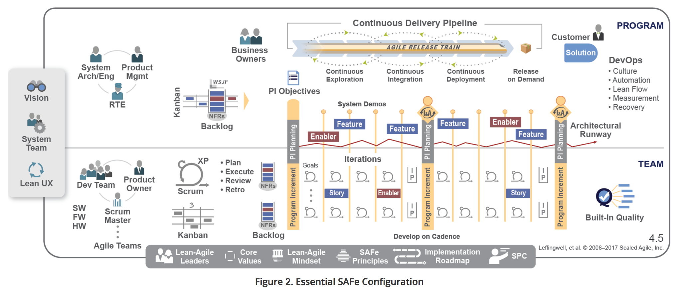
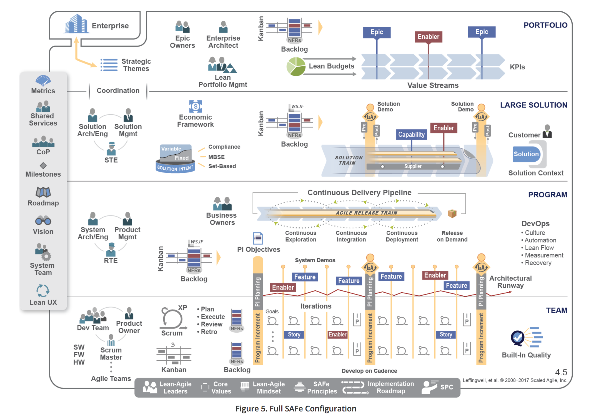
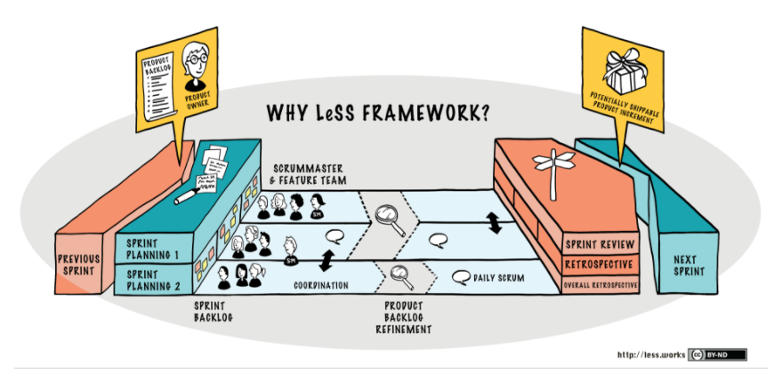
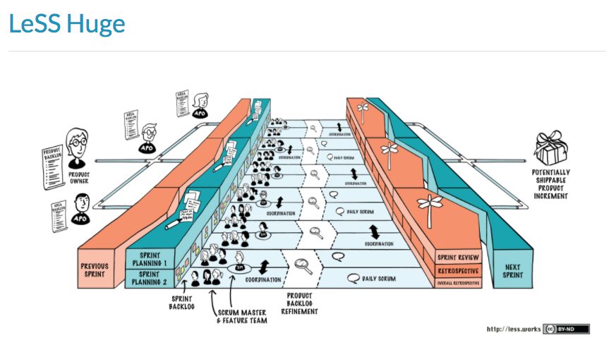

# Scaling Frameworks

## What are scaling frameworks?

As agile continues to grow in popularity, so does the idea of scaling out agile across a whole organisation.

As such there are now quite a few scaling frameworks in the market.

What do I mean by scaling across a whole organisation? well to put it simply, agile practices are commonly adopted in project teams/software development teams and not supporting functions such as HR, Finance and the Contact Centre to give a few examples.

Scaling fameworks attempt to close that gap by having a whole organisation work in a consistent approach. A weakness of this, is that individual circumstances are not acknolwedged and it can feel as if its process and tools rather than individuals and iteractions.

## What scaling frameworks exist?

There are quite a few, each has a different interpretation to process and principles and method for adopting the framework.

I'm going to focus on the 3 most popular scaling frameworks, SAFe, LeSS and DAD.

- SAFe (Scaled Agile Framework for Enterprises)
- LeSS (Large Scale Scrum)
- DAD (Disciplined Agile Delivery)

## SAFe

[SAFe](http://www.scaledagileframework.com/) is probably the most commonly deployed and acknolwedged scaling framework.

### What is SAFe?

In their own words, SAFe is;

The Scaled Agile Framework (SAFe®) helps businesses address the significant challenges of developing and delivering enterprise-class software and systems in the shortest sustainable lead time. It is as an online, freely revealed knowledge base of proven success patterns for implementing Lean-Agile software and systems at enterprise scale. 

SAFe synchronizes alignment, collaboration, and delivery for large numbers of Agile teams. Scalable and configurable, SAFe allows each organization to adapt it to its own business needs. It supports smaller-scale solutions employing 50–125 practitioners, as well as complex systems that require thousands of people. 

An extensive body of knowledge, SAFe describes the roles, responsibilities, artifacts, and activities necessary to implement Lean-Agile development. To illustrate SAFe concepts, this website features an interactive Big Picture graphic, which is a visual overview of the framework and is the primary user interface to the knowledge base. Each icon of the image is clickable, offering access to an article on that topic, as well as links to related information.

Image credit: www.scaledagileframework.com

### SAFe Configurations 

There are 4 configurations of SAFe

There are four out-of-box configurations that create its scalable and configurable approach.

Image credit: www.scaledagileframework.com

- Essential SAFe 
- Large Solution SAFe
- Portfolio SAFe 
- Full SAFe

Essential SAFe
 
Image credit: www.scaledagileframework.com

Large Solution SAFe

Image credit: www.scaledagileframework.com

Portfolio SAFe 

Image credit: www.scaledagileframework.com

Full SAFe

Image credit: www.scaledagileframework.com

For more information on the configurations, you can read that [here](http://www.scaledagileframework.com/what-is-safe/)

## Reviews of SAFe

There are some intresting views on SAFe from well respected agile consultants/coaches etc which I have listed below;

Ron Jefferies - [Why SAFe is good but not good enough](http://xprogramming.com/articles/safe-good-but-not-good-enough/)
Petter Sadington - [Scaled agile framework a review](https://agilescout.com/scaled-agile-framework-safe-review/)
David Snowden -[SAFe the infantillism of management] (http://cognitive-edge.com/blog/safe-the-infantilism-of-management/)

## SAFe Key Facts

- Focuses on Lean thinking
- Uses Scrum at team level
- Focuses on 3 levels, Portfolio, Programme and Team
- Has the concept of release trains
- Uses Cost of Delay from Don Reinertsen

## Reviews of SAFe

There are some intresting views on SAFe from well respected agile consultants/coaches etc which I have listed below;

- Ron Jefferies - [Why SAFe is good but not good enough](http://xprogramming.com/articles/safe-good-but-not-good-enough/)
- Petter Sadington - [Scaled agile framework a review](https://agilescout.com/scaled-agile-framework-safe-review/)
- David Snowden -[SAFe the infantillism of management](http://cognitive-edge.com/blog/safe-the-infantilism-of-management/)

## LeSS - Large Scale Scrum

[LeSS](https://less.works/less/framework/index.html) can be viewed as a scaling framework for product development, but can also be viewed as a descaling framework for organizations. It attempts to remove organizational complexity by solving problems in product development in a different and simpler way. 

Note that simpler doesn’t mean easier, especially in the short run. Even though LeSS is simple, it is exceptionally hard to adopt well in organizations.

Image credit: www.less.works

## Principles of LeSS

- Large-Scale Scrum is Scrum
- Empirical process control
- Transparency
- More with less
- Whole product thinking
- Customer centric
- Continuous improvement towards perfection
- Systems thinking
- Lean thinking
- Queuing theory

To understand more detail on the above principles, you can read about it [here](https://less.works/less/principles/overview.html)

## Types of LeSS

LeSS provides two different large-scale Scrum frameworks. Most of the scaling elements of LeSS are focused on directing the attention of all of the teams onto the whole product instead of “my part.” Global and “end-to-end” focus are perhaps the dominant problems to solve in scaling. The two frameworks – which are basically single-team Scrum scaled up – are:

- LeSS: Up to eight teams (of eight people each).
- LeSS Huge: Up to a few thousand people on one product.

Image credit: www.less.works

## What's different in LeSS (compared to Scrum)

- Sprint Planning Part 1: In addition to the one Product Owner, it includes people from all teams. Let team members self-manage to decide their division of Product Backlog Items. Team members also discuss opportunities to find shared work and cooperate, especially for related items.
- Sprint Planning Part 2: This is held independently (and usually in parallel) by each Team, though sometimes for simple coordination and learning two or more Teams may hold it in the same room (in different areas).
- Daily Scrum: This is also held independently by each Team, though a member of Team A may observe Team B’s Daily Scrum, to increase information sharing.
- Coordination: Just Talk, Communicate in Code, Travelers, Open Space, and Communities.
- Overall PBR: There may be an optional and short overall Product Backlog Refinement (PBR) meeting that includes the one Product Owner and people from all teams. The key purpose is to decide which teams are likely to implement which items and therefore select those items for later in-depth single-team PBR. It is also a chance to increase alignment with the Product Owner and all teams.
- Product Backlog Refinement: The only requirement in LeSS is single-team PBR, the same as in one-team Scrum. But a common and useful variation is multi-team PBR, where two or more Teams are in the same room together, to increase learning and coordination.
- Sprint Review: In addition to the one Product Owner, it includes people from all teams, and relevant customers/users and other stakeholders. For the phase of inspecting the product increment and new items, consider a “bazaar” or “science fair” style: a large room with multiple areas, each staffed by team members, where the items developed by teams are shown and discussed.
- Overall Retrospective: This is a new meeting not found in one-team Scrum, and its purpose is to explore improving the overall system, rather than focusing on one Team. The maximum duration is 45 minutes per week of Sprint. It includes the Product Owner, Scrum Masters, and rotating representatives from each Team.

## DAD - Disciplined Agile Delivery
